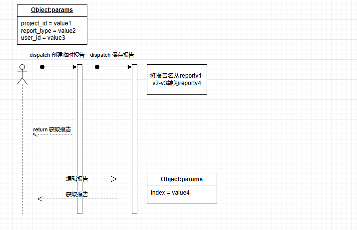

## 1.0 需求背景

当前场景:当前复盘报告在保存和编辑时概率出现保存失败和数据丢失，暂无稳定复现方式。所以需要修改当前报告创建和编辑的方式。

## 2.0 方案对比

### 2.0.1 原方案

创建报告时使用项目Id，报告类型，用户Id组成唯一标识绑定数据到协同服务，此时这部分数据可充当个人的草稿使用，实时保存。创建报告将名字转为mysql主键，
此时会概率触发保存失败问题，sharedb-mongo对象支持mongo的query语句查询，但是原则上不应该接收封装外的编辑操作或者新增操作。https://github.com/share/sharedb-mongo

### 2.0.2 新方案

业务服务收到创建报告请求时额外添加一个唯一标识符，并将标识符与mysql索引进行映射，保存到mongodb中，后续编辑和查询时
以便在单个文档上协作。将文档数据分散存储在多个用户设备，每个用户都可直接编辑文档并将更改同步到其他用户设备。提供更好灵活性和可扩展性，但可能会有数据同步不及时或数据冲突问题

### 1.1.3架构对比

|     | 服务器负担 | 实时性 | 一致性   | 扩展性   | 兼容性   |
| --- | ----- | ------- | ----- | ----- | ----- |
| C/S | 大     | 弱       | ==强== | ==强== | ==强== |
| P2P | ==小== | ==强==   | 弱     | 弱     | 弱     |

文档格式为json,更新大小约为5KB,小组成员数量约10人,预估最大总并发数据量:单个包体(5KB)*上传(10)*分发(10)=500KB
![[Pasted image 20240709150906.png]]
当前场景下总数据量较小,时延较低,且大多数商业方案侧重C/S架构，以实现更精细控制。 因此，本文也讨论一致性扩展性和兼容性更好的C/S架构设计服务。

## 2.0主流产品调研
首先,我们应当明确协同编辑功能的特性.你不能只让每个人自己工作，然后合并每个人的副本或选取最后一次编辑。用户实际上应该可以看到对方正在做什么，并获得即时反馈。

### 2.1.1 Google Docs

Google Docs 是基于云盘系统扩展的办公系统，具有一系列功能，包括文档存储，共享，格式化，编辑等.系统有以下几个主要部分:
- 文件存储:由于 Google 文档是 Google 云端硬盘的一部分，因此也包含了存储功能。该系统允许用户将文件（文档）分组到文件夹，并支持编辑/创建/删除等功能。它更像一个操作系统。
- 在线编辑和格式化:毫无疑问，Google 文档的核心功能之一就是在线编辑。它支持几乎所有的微软 Office 操作。
- 协同编辑:Google Docs 允许多个人同时编辑单个文档
- 访问控制:你可以与你的朋友分享文档，并给予不同的权限（所有者，只读，允许评论等）。

Google docs的协同编辑基于版本控制实现,每次修改都会对文档创建一个版本,并显示diff,你可以查看文档的历史版本并选择保存.
服务器可以为每个人保留量份相同的文档，并跟踪完整的修订历史。当 A 通过在开头添加`x`来编辑文档时，这个改变将与 A 所看到的最后修订一起发送到服务器。假设此时 B 删除最后一个字符`c`，并且这个改变也是这样发送到服务器。

由于服务器知道修改在哪个版本上进行，因此会相应地调整更改。更具体地说，B 的变化是删除第三个字符`c`，它将被转换为删除第四个字符，因为 A 在开头添加了`x`。

这就是所谓的操作转换（Operational Tranformation）基本思想是根据修改和其他合作者的修改来转换每个人的改动。

goole docs 编辑页面
![[Pasted image 20240710095231.png]]

### 2.1.2 飞书云文档

飞书是一款国产综合性的办公协作平台产品,飞书云文档在前端设计简洁，取消了传统工具栏，采用隐藏式工具栏，提供简洁的白纸样式编辑界面，旨在让用户专注于内容创作,用户目前使用的产品就是飞书.

在协同编辑功能上使用了和Google Docs相似的云盘加OT方案,在持久化方面也同样使用了版本控制的方式存储文件和相关信息

飞书历史版本页面
![[Pasted image 20240710095330.png]]

### 2.1.3 冲突处理OT与CRDT

在线文档实时协同编辑的难点之一在于协同冲突处理,OT算法是解决协同冲突处理的主要方案.

#### 2.1.3.1 编辑锁

当有人在编辑某个文档时，系统会将这个文档锁定，避免其他人同时编辑。编辑锁的实现方式简单粗暴，但会直接影响用户体验。

#### 2.1.3.2 diff-patch

基于 Git 等版本管理类似的思想，对内容进行差异对比、合并等操作，包括 GNU diff-patch、Myer’s diff-patch 等方案。diff-patch 可以对冲突进行自助合并，也可以在冲突出现时交给用户处理。

#### 2.1.3.3 最终一致性实现

包括 Operational Transformation（OT）、 Conflict-free replicated data type(CRDT，称为无冲突可复制数据类型)。OT 算法是 石墨文档，腾讯文档，飞书文档，Google Docs 中所采用的方案，Atom 编辑器使用的则是 CRDT。

  
#### 2.1.3.4 OT 和 CRDT

OT 和 CRDT 两种方法的相似之处在于它们提供最终的一致性。不同之处在于他们的操作方式：

- OT 通过更改操作来做到这一点
- OT 会对编辑进行操作的拆分、转换，实现冲突处理的效果
- OT 并不包括具体的实现，因此需要项目自行实现，但可以根据项目需要进行高精度的冲突处理
- CRDT 通过更改状态来做到这一点
- 基本上，CRDT 是数据结构，当使用相同的操作集进行更新时，即使这些操作以不同的顺序应用，它们始终会收敛在相同的表示形式上
- CRDT 有两种方法：基于操作和基于状态

对于富文本编辑等更高级的结构，OT 用复杂性换来了对用户预期的实现，而 CRDT 则更加关注数据结构，随着数据结构的复杂度上升，算法的时间和空间复杂度也会呈指数上升的，会带来性能上的挑战。因此，如今大多数实时协同编辑都基于 OT 算法来实现。

## 3.0 总结

### 3.1 场景对比
当前场景的对象为5KB左右的json,可以使用websoket根据固定的json结构更新的方式来实现,缺点是缺乏扩展性.
OT不仅适用纯文本、JSON数据,也能兼容各种富文本,有更多可扩展的空间.CRDT维护成本过高,所以选用shareddb存储.

Simple realtime client/server sync with ShareDB
![[demo.gif]]

参考链接
https://github.com/share/sharedb
https://www.cnblogs.com/WindrunnerMax/p/17114099.html
https://operational-transformation.github.io/index.html
https://zhuanlan.zhihu.com/p/692480370