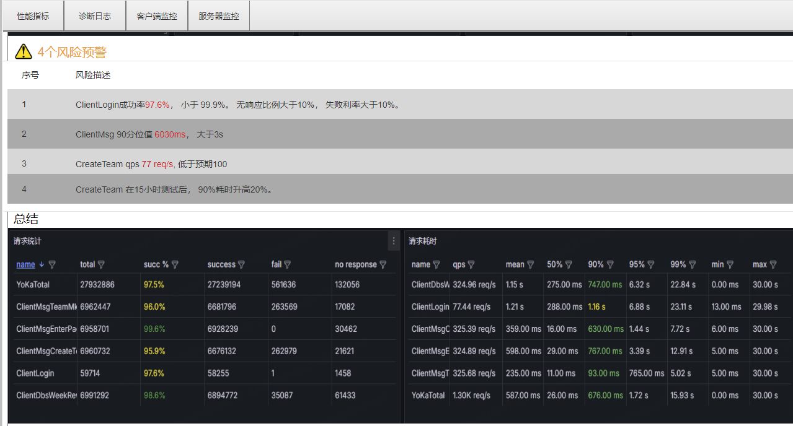

# k8s版本


# 需求背景

1. 降低执行复杂度，测开开发完脚本后， 研发、QA都可以使用。
2. 降低多机部署执行成本，一次开发，到处执行。 可在 开发网、国内公网（杭州）、海外（新加坡）直接压测
3. 支持计划任务，方便自动化。 后续可接入CI


# [功能点](https://18xjfh.axshare.com/)


主要包含四大模块

1. [工作台](###作业)

   创建作业、执行任务、查看数据相关

2. [施压机](###施压机性能)

   包括共享机器、私有机器。  共享机器可供所有业务共同使用， 私有机器仅自己业务使用。  可以查看不同机器的性能状态和任务分布

3. 全局设置

   包括镜像仓库管理、类K8S的namespace管理， 类granfa的SAL配置

4. 测试日历

   可查看已执行的任务日历，和计划任务日历。


各模块的关联性如下图：


## 作业

作业是一组可执行任务的最小集合，包含了用例，SAL, 压力配置， 什么时候执行。  用例对应了压力引擎的配置（用例目前不直接对平台暴露，隐藏在作业中）

即什么时候，在哪里，设置多大压力，跑某个用例。


## 任务

一个作业通过立即执行/定时执行后，生成的对象即任务。

 任务的的产物包括**核心产物**及**辅助产物**， 核心产物及**报告数据**和**服务器性能**， 辅助产物为**诊断日志**和**客户端性能**。 


### 报告

反应了服务器业务指标， 包括请求成功率， QPS等数据



### 诊断日志

机器人的日志，可查看不同实例近三天日志


### 施压机性能

主要用于观察施压机自身是否性能过载，以便根据性能情况调整压力 .


### 被测机性能

即服务器监控


# 概要设计


1. 对于任意压力引擎,  打包成镜像。  定义镜像的标准输入及标准输出
2. 平台层解析页面参数，一： 设置相应的压力源、Pod数量；  二： 把页面参数根据规则传递给Pod
3. 机器人端性能搜集包括日志，机器人性能， QPS数据，  其中日志和机器人性能随机Pod启动搜集，  QPS数据需接入SDK


## 工作台

### 作业增删改查


1.  作业表是tb_work， 里面索引了tb_case索引， tb_alert索引
2.  创建作业时，先去tb_case创建， tb_case除了自有信息（用例名，人数，账号登），还会索引tb_tools_v 工具版本索引
3.  sla作为全局索引，预留了一个default名字，后续如果不想作为全局，可以引用其他名字。 修改的话目前就就是修改全局的SLA
4.  压力配置部分存储在tb_work中，包括单机多少人，需要多少个pod等


### 启动作业（开始测试）

 .png)


1. web 提交一个测试作业，只需要带workid， 后台根据workid，查询到对应的case（版本和配置）， 挂载的SAL， 需要跑多少pod等信息。 在数据库创建一个task， task中索引相应的report， log， client_metrics,  和  server_metrics等

2. 根据提交的人数，pod等信息，设置一个合理的策略， 计算出需要多少pod， 每个pod执行多少人。 把这些信息作为环境变量，传给等下启动的每个pod

3. 通过k8s cli命令，传入得到的harbor地址，以及上述配置文件作为环境变量， 并且设置合理的limit（目前单核单Pod）。 记录下子任务， Node信息和Pod名，Env等。 

4. 监听所有pod的状态，同时跟新task的状态（资源下载，Pod启动，开始施压。 这里可能有pod状态不一致的情况，目前不想管）

5. 执行过程中，需要周期性和容器进行通讯，以便获取到异常情况和是否达到。 （机器人需要增加接口）

6. 当所有条件都满足， 就开始停止pod

   

异常情况：

1. 如果pod停止了，怎么办了
2. 如果里面的参数怎么都达不到，怎么办

### 任务详情（报告详情）

#### 性能指标

这块和原来一样，通过report_id和时间range来查询

#### 诊断日志

传入podname， 时间戳

#### 客户端监控

这块从Prometheus中获取

#### 服务端监控


## 施压机

- 共享资源

写一个中间服务、或者在center中实现， 通过k8s_api获取metrics

- 私有资源

无非是调用资源的时候，多加一个label标签

## 全局设置

### 环境管理

- tbEnv表增加 name 和  {k: v}的映射

### 仓库资源

- 记录在tbVersion中，记录项目和仓库
- 根据记录的项目和仓库，通过harbor api查询对应的tag


## 测试日历

### 测试简报

1. 任务频次， 查看task表，按日期统计。
2. 版本测试，按照增加一个版本字段，按照版本统计
3. 历史任务，查看task表，按日期搜索出report数量
4. 测试计划，搜索schedule表

### 作业计划	

//理论上需要支持任务编排+任务定时。 实际上任务编排只需要支持顺序， 主要是在定时到了以后，通知我，需要执行某个任务了就可以了


# 详细设计

## 时序设计

### 创建作业


###  启动任务


todo： 这里的压力配置是实时的，那么当再次执行时，是否要重新按照这个配置来执行呢？

### 中止任务


### 定时任务

内部定时，或者外部回调均可。

### 查看任务

#### 报告

#### 日志

#### 

这里的关键是， 需要去分析一下tracing的http请求，转换一下。 其次是log的key待确定

特别是app_name 其实是一种pod_name,  当有多个pod时， 需要把所有pod_name都取出来


#### 客户端监控


#### 服务端监控

同客户端监控数据获取，只不过Prometheus接口需要和运维接口打通


### 其他

#### 工作台

##### 用例列表

1.  列表数据可以搜索搜索[tb_work](###作业表)表， 根据work表中的case_id,  可以从中解析出用例名、人数、并发量、关联报告登
2. 点击关联报告， 则根据tb_work表中work_id作为key， 去tb_task表中查询对应的执行记录。

##### 实时任务（todo， UI还要调整）

1. 搜索tb_task表，status为执行中的任务， 如果只有一个任务，之间显示执行状态

##### 报告列表（todo， 这里都要按用例区分）

1. 搜索tb_task表， 和原来保持一致，唯一要考虑的就是可能需要根据用例来区分

#### 施压机（todo）

1.  对于每个加入k8s的node，打相应区域的标签，表明是内网、杭州、亚马逊、私有
2. 对于每个区域，通过k8s cli查询node
3. 对于每个node，查询redis获取对应的任务状态

#### 全局设置

##### 告警设置（todo)

##### 环境管理

1. 每次创建环境，向centersvr请求创建
2. 对于每个k-v, 发送一个centersvr请求

这里有一个关联任务，考虑是实时计算，还是提前就存储。

##### 仓库

写默认的harbor路径， 仓库名，  镜像


#### 测试日历


## 机器人

机器人的数据被切分后

分位几块数据

| 机器人输入 | 变量名      | 备注            |
| ----- | -------- | ------------- |
| 环境变量  | RobotNum | 作为必要的参数， 包括人数 |
|       | WarmUp   | 加载频率,  每秒加载数量 |
|       | Timeout  | 超时设置          |
|       | RunTime  | 测试时长          |
|       | RunNum   | 执行轮次          |


用例配置

| 参数            |      |      |
| --------------- | ---- | ---- |
| --acount-file   |      |      |
| --acount-on     |      |      |
| --acount-prefix |      |      |
| --acount-idx    |      |      |
|                 |      |      |
| --log-on        |      |      |
| --log-level     |      |      |
|                 |      |      |


自定义配置

| 参数       |      |      |
| ---------- | ---- | ---- |
| --init_num |      |      |
|            |      |      |


环境配置

| 参数           |      |      |
| -------------- | ---- | ---- |
| --gamesvr-ip   |      |      |
| --gamesvr-port |      |      |
|                |      |      |


## 数据库

目前的话，需要是登记项目、仓库。  因为版本每次都要拉新的tag

目前压测的项目都在yokaqa里

### 用例表

- tb_game_case （镜像版本和自定义参数结构可以再思考下）

Case结构

| 字段             | 字段类型        | 是否必填 | 说明                |
| :------------- | ----------- | ---- | ----------------- |
| case_id        | int         |      | 用例id,  索引         |
| name           |             |      | 用例名               |
| Author         | varchar(16) |      | 作者                |
| 镜像、版本          |             |      |                   |
| robotnum       |             |      | 人数                |
| timeout        |             |      | 超时设置              |
| warmup         |             |      | 每秒加载多少万           |
| warmup_seconds |             |      | 多少秒完成热身           |
| duration       |             |      | 持续时间（注意和执行轮次互斥）   |
| loopnum        |             |      | 执行轮次（主要和持续时间互斥）   |
| account_file   |             |      | 账号文件 （可空）         |
| account_prefix |             |      | 前缀 （可空）           |
| account_idx    |             |      | 账号索引 （可空）         |
| account_on     |             |      | account是否开启（默认关闭） |
| log_levevl     |             |      | 日志等级              |
| log_on         |             |      | 日志开关（默认关闭日志）      |
| constomvar     |             |      | 自定义参数             |
|                |             |      |                   |
|                |             |      |                   |


tb_jmeter_case （整体结构未明确）

| 字段    | 字段类型 | 说明          |
| ------- | -------- | ------------- |
| id      | int      | 用例id        |
| task_id | int      | 任务id,  索引 |
| case_id |          |               |
|         |          |               |


### SLA表(预留-todo)

| 字段       | 字段类型 | 说明                             |
| ---------- | -------- | -------------------------------- |
| sla_id     | 1        | 全局唯一                         |
| sla_name   | defualt  | default, 后面一个项目可以多个sla |
| project_id | 0        |                                  |
|            |          |                                  |

默认都从1号sla_id中来设置


### Env表

| 字段      | 字段类型 | 说明     |      |
| --------- | -------- | -------- | ---- |
| id        |          | 环境id   |      |
| projectid |          |          |      |
| name      |          | 环境名字 |      |
| key       |          | 字段key  |      |
| value     |          | 字段名   |      |
|           |          |          |      |


### 作业表

| 字段       | 字段类型              | 说明                                                   |
| ---------- | --------------------- | ------------------------------------------------------ |
| job_id     | 作业id                | 主键                                                   |
| case_id    | 关联的用例id          | 用例可以自由选择， 索引                                |
| case_type  | 用例类型              | jmeter、游戏、也可以加其他的                           |
| sla_id     | 关联的sla_id          | 告警后面外部可能按环境独立。 索引                      |
| strategyid | 施压机测试            |                                                        |
| env-id     | envid                 | 环境id可以自由变更（默认空）                           |
| zone       |                       | 施压区域，  索引                                       |
| podnum     |                       | pod数量                                                |
| pod        |                       | 单个pod虚拟人数                                        |
| expect     | {"ip1": 1, "ip2":  5} | 期望分配列表                                           |
| task_num   |                       | 报告总数，如果报告或者任务删除，则需要修改task_num数量 |


### 任务表

| 字段           | 字段类型      | 说明                                                         |
| -------------- | ------------- | ------------------------------------------------------------ |
| id             | int           | 任务id，主键自增                                             |
| case_id        | int           | case表id， 如果是远程执行，caseid为0                         |
| reportid       | int           | 报告id                                                       |
| name           | varchar(32)   | 任务名称                                                     |
| creator        | varchar(32)   | 任务创建人                                                   |
| status         | tinyint       | 0： 表示完成                                                                                                                                                                                                 1： 进行中                                                                                                                                                                                                                        2： 表示中止，目前主要是长时间无心跳包被中止                                                                                                                                                                                                        3： 表示页面手动停止 |
| taglist        | varchar(256)  | 任务标签 ["tag1", "tag2", "tag3"]                            |
| nodelist       | varchar(1024) | 节点信息  [{"name": "node1", "status": 0}, {}, {}]   json格式 |
| created_at     | datetime      | 创建时间                                                     |
| updated_at     | datetime      | 更新时间                                                     |
| deleted_at     | datetime      | 删除时间                                                     |
|                |               |                                                              |
| process        | float         | 进度管理，根据测试时间，或者测试循环次数来计算               |
| job_id         | int           | 新增work_id,  或者修改case_id                                |
| ~~is_deleted~~ | ~~bool~~      | ~~删除标记~~                                                 |

nodelist 要扩展

```
{
   {
   "ip": 127.0.0.1, 
   "pod": "yoka-otel-collector-mvd5v",
   "num": 1000,
   }
   
   {
   
   }
   
}
```


### 仓库表

| 字段         | 字段类型 | 说明                       |
| ------------ | -------- | -------------------------- |
| version_id   | 1        | 全局唯一                   |
| project_id   | 0        |                            |
| harbor_addr  |          | https://harbor.dobest.com/ |
| project_name |          | yokaqa                     |
| image        |          | hyl-server-perf            |
|              |          |                            |

默认都从1号sla_id中来设置.

这里不存在harbor版本，到时候都现拉，如果拉不到，新项目无法执行，老项目不影响


### 计划表

| 字段       | 字段类型 |      | 说明 |
| ---------- | -------- | ---- | ---- |
| project_id |          |      |      |
| work_id    |          |      |      |
| cron_exp   |          |      |      |
| on         |          |      |      |
|            |          |      |      |


## 接口设计

### 作业任务

#### 创建作业-游戏作业

接口地址：api/v1/job/create?job_type={}

请求方式:   POST

Param参数：

| type | 类型 |      | 表示       |
| ---- | ---- | ---- | ---------- |
| 0    | int  |      | 表示游戏   |
| 1    | int  |      | 表示jmeter |

Body参数：

| 字段   | 字段类型 | 是否必填 | 说明                                   |
| ------ | -------- | -------- | -------------------------------------- |
| Case   | Case     | 是       | 用例内容                               |
| SLA    | SLA      | 否       | SLA，这部分以索引为主，修改时走SLA接口 |
| Server | Server   | 是       | 被测服务器环境                         |

- Case结构

| 字段名           | 类型 | 是否必填 | 说明                                |      |
| ---------------- | ---- | -------- | ----------------------------------- | ---- |
| harbor           |      |          | harbor地址                          |      |
| project_name     |      |          | 项目名                              |      |
| version          |      |          | 版本号                              |      |
| virtual_player   |      |          | 虚拟玩家数                          |      |
| timeout          |      |          | 超时设置                            |      |
| warmup_per_sec   |      |          | 每秒加载多少                        |      |
| warmup_duration  |      |          | N秒内完成加载                       |      |
| model_pic_addr   |      |          | 模型地址                            |      |
| account_file     |      |          | 文件名                              |      |
| account_prefix   |      |          | 账号前缀                            |      |
| account_idx      |      |          | 账号索引                            |      |
| account_on       |      |          | 账号开关                            |      |
| log_level        |      |          | 日志级别                            |      |
| log_on           |      |          | 日志开关                            |      |
| custom_parameter |      |          | 自定义参数， k-v结构<br />{"k":"v"} |      |

SLA结构

| 字段   | 字段类型 | 是否必填 | 说明          |
| ------ | -------- | -------- | ------------- |
| sal_id |          |          | 索引对应的sla |

这部分到时候再去研究下granfa的告警设置(todo)


Server

| 字段            | 字段类型 | 是否必填 | 说明                                                         |
| --------------- | -------- | -------- | ------------------------------------------------------------ |
| zone_id         |          | 是       | 区域id<br /> 0: 内网<br />1：杭州<br />2：新加坡<br />3：私有环境 |
| virtual_per_pod |          |          | 每个节点多少虚拟人数                                         |
| pod_num         |          |          | 需要多少个虚拟节点                                           |
| env_id          |          |          | 环境env                                                      |

返回

data格式

| 字段   | 字段类型 | 说明             |
| ------ | -------- | ---------------- |
| job_id |          | 返回创建的任务id |
|        |          |                  |


#### 创建作业-Jmeter

接口地址：/api/v1/job/create?type=1

请求方式:   POST

Body参数：

| 字段   | 字段类型 | 是否必填 | 说明                                   |
| ------ | -------- | -------- | -------------------------------------- |
| Case   | Case     | 是       | 用例内容                               |
| SLA    | SLA      | 否       | SLA，这部分以索引为主，修改时走SLA接口 |
| Server | Server   | 是       | 被测服务器环境                         |

Case结构

| 字段名          | 类型   | 是否必填 | 说明                  |
| --------------- | ------ | -------- | --------------------- |
| harbor          |        |          | harbor地址            |
| project_name    |        |          | 项目名                |
| version         |        |          | 版本号                |
|                 |        |          |                       |
| thread          | Thread |          | 线程组相关            |
| thread_run      |        |          | 0:  串行<br />1：并行 |
| timeout         |        |          | 超时设置              |
| warmup_per_sec  |        |          | 每秒加载多少          |
| warmup_duration |        |          | N秒内完成加载         |
|                 |        |          |                       |
| log_level       |        |          | 日志级别              |
| log_on          |        |          | 日志开关              |
|                 |        |          |                       |
|                 |        |          |                       |
|                 |        |          |                       |


Thread结构：

| 字段名           | 类型 | 是否必填 | 说明                                                         |
| ---------------- | ---- | -------- | ------------------------------------------------------------ |
| thread_name      |      |          | 线程组名                                                     |
| thread_num       |      |          | 虚拟玩家数                                                   |
| timeout          |      |          | 超时设置                                                     |
| warmup_per_sec   |      |          | 每秒加载多少                                                 |
| warmup_duration  |      |          | N秒内完成加载                                                |
|                  |      |          |                                                              |
| custom_parameter |      |          | 自定义参数， t-k-v结构<br /> t表示thread， k-v  表示具体结构{"k":"v"} |


返回参数：

data格式：

| 字段   | 字段类型 | 说明             |
| ------ | -------- | ---------------- |
| job_id |          | 返回创建的任务id |
|        |          |                  |


#### 启动作业

接口地址：/api/v1/task/start?type=1

请求方式:   POST

| 字段名   | 类型 | 是否必填 | 说明                                                 |
| -------- | ---- | -------- | ---------------------------------------------------- |
| job_id   |      |          | 作业id                                               |
| job_type |      |          | 作业类型<br />0: 表示游戏压测<br />1: 表示jmeter压测 |
|          |      |          |                                                      |

返回参数：

##### Task返回结构

| 字段名       | 类型   | 说明                                                         |
| ------------ | ------ | ------------------------------------------------------------ |
| taskid       | int    | 任务id，可在平台的任务列表可查询关联记录                     |
| name         | string | 用例名                                                       |
| creator      | string | 创建人                                                       |
| toggle_mode  |        | 触发模式， 0表网页启动， 1表远程启动， 2表CI/CD              |
| create_time  |        | 创建时间                                                     |
| end_time     |        | 结束时间                                                     |
| tag_list     | TAG    | 标签                                                         |
| status       |        | <br />表示<br />任务的整体状态<br />0： 表示完成                                                                                                                                                                                                 1： 进行中                                                                                                                                                                                                                        2： 表示异常中止，目前主要是长时间无心跳包被中止                                                                                                                                                                                                        3： 表示手动停止 |
| task_process |        | 表示整个任务的状态<br />0： 资源下载<br />1： K8S拉起中，至少一个pod完成资源拉起<br />2： 施压阶段<br />3： 关闭中<br />4： 完成 |
| process      | float  | 任务进度百分比                                               |
|              |        |                                                              |
| reportid     | int    | 报告id，可根据reportid查询influxdb数据记录                   |
| client_list  | Client | 施压端相关信息， 根据client信息，查询对应的日志和性能        |
| server_list  | Server | 被压服务器相关信息                                           |

Client

| 字段名  | 类型 | 说明             |
| ------- | ---- | ---------------- |
| host    |      | 被调度的主机节点 |
| podname |      | 被调度的pod名    |
|         |      |                  |

Server

| 字段名  | 类型 | 说明                   |
| ------- | ---- | ---------------------- |
| host    |      | 服务器被监控的主机节点 |
| process |      | 被监控进程             |
|         |      |                        |


#### 作业列表

接口地址： /api/v1/jobs?pageSize={}&pageId={}&orderBy={}&order={}&searchKey={}

请求方式:   GET

| 字段名     | 类型 | 是否必填 | 说明                           |
| ---------- | ---- | -------- | ------------------------------ |
| page_size  |      |          | 每页显示多少                   |
| page_id    |      |          | 第几页                         |
| order_id   |      |          | 排序id，根据作业列表json字段   |
| order_by   |      |          | asc: 升序<br />desc: 降序      |
| search_key |      |          | 搜索的关键字，将模糊匹配用例名 |
|            |      |          |                                |

返回参数：

| 字段名 | 类型       | 说明            |
| ------ | ---------- | --------------- |
| total  | int        | 总条数          |
| list   | Array<Job> | list是job的列表 |

Job结构

| 字段名     | 类型   | 说明                                                         |
| :--------- | ------ | ------------------------------------------------------------ |
| job_id     |        | 作业id                                                       |
|            |        |                                                              |
| name       | string | 用例名                                                       |
| creator    | string | 创建人                                                       |
| robotnum   | int    | 压测人数                                                                                                                                                                                                                 1. 如果从网页创建的，读取配置文件中的人数                                                                                                                                                             2. 如果是从压测客户端传入，则合计所有压测客户端的总和 |
| Frequency  |        | 每秒加载频率                                                 |
| createtime |        | 创建时间                                                     |
| modifytime |        | 修改时间                                                     |
| job_type   |        | 用例类型<br />0： 游戏<br />1： jmeter                       |
| report_num |        | 关联报告数                                                   |
|            |        |                                                              |

todo：这里要不要增加一个desc


#### 实时任务

接口地址：/api/v1/tasks?status=0

请求方式:   GET

请求参数：

| 字段名 | 类型        | 是否必填         | 说明 |
| ------ | ----------- | ---------------- | ---- |
| 字段名 | 类型        | 说明             |      |
| total  | int         | 总条数           |      |
| list   | Array<Task> | list是task的列表 |      |

[Task结构](######Task返回结构)


#### 报告列表（任务列表）

接口地址：/api/v1/tasks/pageNum=&pageSize=&key=&orderBy={}&order={}&searchKey={}

请求方式:  GET

请求参数：

| 字段名    | 类型   | 必填 | 说明                                   |
| --------- | ------ | ---- | -------------------------------------- |
| pageNum   | int    | 是   | 页码，第一页pageNum=1                  |
| pageSize  | int    | 是   | 单页大小，(0, 100]                     |
| searchKey | string | 否   | 搜索关键字，会匹配任务名，创建人，标签 |
| orderBy   |        |      |                                        |
| order     |        |      |                                        |


返回参数

| 字段名 | 类型        | 说明               |
| ------ | ----------- | ------------------ |
| total  | int         | 总条数             |
| list   | Array<Task> | list是report的列表 |

[Task结构](######Task返回结构)


### 报告

#### 诊断日志

接口地址：/api/v1/tasks/{id}/logs?

请求方式:  GET

请求参数：

| 字段名         | 类型 | 必填                                              |
| -------------- | ---- | ------------------------------------------------- |
| projectid      |      | 项目id                                            |
| app_name       |      | 容器的, app_name可以解析序号。 页面展示按序号展示 |
| timestampStart |      |                                                   |
| timestampEnd   |      |                                                   |
| limit          |      |                                                   |
|                |      |                                                   |
|                |      |                                                   |

todo： 这里的数据设计到test和prod的问题。 这块需要后端单独处理，就不要放到前端了


返回Body

| 字段名   | 类型       | 必填       |
| -------- | ---------- | ---------- |
| total    |            | 日志条目数 |
| log_list | Array<Log> | 日志列表   |
|          |            |            |


Log结构

| 字段名    | 类型 | 必填 |
| --------- | ---- | ---- |
| timestamp |      |      |
| app_name  |      |      |
| file      |      |      |
| level     |      |      |
| body      |      |      |
|           |      |      |


#### 客户端监控

接口地址：/api/v1/tasks/{task_id}/client_monitor?

请求方式:  GET

请求参数：

| 字段名  | 类型 | 必填 | 说明   |
| ------- | ---- | ---- | ------ |
| task_id |      |      | 任务id |

响应Body

|      |      |      |
| ---- | ---- | ---- |
|      |      |      |
|      |      |      |
|      |      |      |


#### 服务器监控

接口地址：/api/v1/tasks/{id}/logs?

请求方式:  GET

请求参数：


### 施压机

接口地址：/api/v1/servers/share

请求方式:   GET

请求参数：


返回：

返回一个server list ，包含不同区域的

| 字段名 | 类型 | 是否必填 | 说明 |
| ------ | ---- | -------- | ---- |
| addr   |      |          |      |
|        |      |          |      |
|        |      |          |      |


对于每个机器，返回该机器上每个pod信息

| 字段名 | 类型 | 是否必填 | 说明 |
| ------ | ---- | -------- | ---- |
| addr   |      |          |      |
|        |      |          |      |
|        |      |          |      |

返回

```json
[
{
    "zone": 0,
    ""
}
]
```

#### 共享资源

接口地址：/api/v1/servers/share?zone_id={}

请求方式:   GET

请求参数：

| 字段名  | 类型 | 是否必填 | 说明                                                         |
| ------- | ---- | -------- | ------------------------------------------------------------ |
| zone_id |      |          | 区域id<br /> 0: 内网<br />1：杭州<br />2：新加坡<br />3：私有环境 |


返回

| 字段名 | 类型              | 说明               |
| ------ | ----------------- | ------------------ |
| total  | int               | 总条数             |
| list   | Array<ServerNode> | list是report的列表 |


ServerNode结构

| 字段名   | 类型 | 说明     |
| -------- | ---- | -------- |
| host     |      | 主机地址 |
| pod_list | Pod  | pod节点  |
| status   |      | 节点状态 |

//todo:  这里需要根据节点情况，来设计空闲，占用，忙碌等


pod结构

| 字段名   | 类型    | 说明     |
| -------- | ------- | -------- |
| pod_name |         | 主机地址 |
| project  |         | 项目名   |
| job_name |         | 作业名   |
| status   |         | 作业状态 |
| creator  |         | 作业人   |
| metrics  | Metrics |          |

每个pod能够查询到当前任务情况。 Redis中记录Pod和Task的关系

todo: 这里空闲的pod如何表达


Metrics结构

| 字段名 | 类型 | 说明 |
| ------ | ---- | ---- |
| CPU    |      |      |
| MEM    |      |      |
|        |      |      |


#### 私有资源

接口地址：/api/v1/servers/private

请求方式:   GET

请求参数：

| 字段名 | 类型 | 是否必填 | 说明 |
| ------ | ---- | -------- | ---- |
|        |      |          |      |

### 全局设置

#### 性能基线

#### 环境管理

##### 添加环境变量

接口地址：/api/v1/environment/key

请求方式:   POST

请求参数：

| 字段名 | 类型 | 是否必填 | 说明     |
| ------ | ---- | -------- | -------- |
| env_id |      |          | 环境id   |
| key    |      |          | 变量名   |
| value  |      |          | 变量值   |
| desc   |      |          | 描述说明 |

##### 删除环境变量

接口地址：/api/v1/environment/key

请求方式:   DELETE

请求参数：

| 字段名 | 类型 | 是否必填 | 说明 |
| ------ | ---- | -------- | ---- |
| env_id |      |          |      |
| key    |      |          |      |

##### 删除环境

接口地址：/api/v1/environment

请求方式:   DELETE

请求参数：

| 字段名 | 类型 | 是否必填 | 说明 |
| ------ | ---- | -------- | ---- |
| env_id |      |          |      |

##### 查找环境

接口地址：/api/v1/environment

请求方式:   GET

请求参数：

| 字段名          | 类型     | 是否必填 | 说明         |
| --------------- | -------- | -------- | ------------ |
| env_id          |          |          | 环境id       |
| env_name        |          |          | 环境名       |
| related_job_num |          |          | 被引用的作业 |
| variable_list   | VARIABLE |          |              |

VARIABLE结构

| 字段名 | 类型 | 是否必填 | 说明   |
| ------ | ---- | -------- | ------ |
| key    |      |          | 变量名 |
| value  |      |          | 变量值 |
| desc   |      |          | 说明   |

#### 仓库

接口地址：/api/v1/groups={}&project={}

请求方式:   GET

请求参数：

| 字段名  | 类型 | 是否必填 | 说明 |
| ------- | ---- | -------- | ---- |
| groups  |      |          |      |
| project |      |          |      |

返回

| 字段名      | 类型 | 说明           |
| ----------- | ---- | -------------- |
| update_time |      | 更新时间       |
| harbor_addr |      | harbor完整地址 |
| tag         |      | 版本           |
| desc        |      | 描述           |


### 全局设

##### 删除环境

### 任务日历

##### 测试频次

接口地址：/api/v1/calendar/{project_id}/tasks/?start_time={}&end_time={}

请求方式:   GET

请求参数：

| 字段名     | 类型 | 说明     |
| ---------- | ---- | -------- |
| project_id |      | 项目id   |
| start_time |      | 起始时间 |
| end_time   |      | 结束时间 |

返回Body：

| 字段名 | 类型         | 说明         |
| ------ | ------------ | ------------ |
| t      | Array<int64> | 日期         |
| v      | Array<int64> | 任务执行次数 |
|        |              |              |


##### 版本频次

接口地址：/api/v1/calendar/{project_id}/version/?start_time={}&end_time={}

请求方式:   GET

请求参数：如上

返回Body：

| 字段名 | 类型          | 说明         |
| ------ | ------------- | ------------ |
| t      | Array<string> | 版本         |
| v      | Array<int64>  | 任务执行次数 |


##### 历史记录

接口地址：/api/v1/calendar/{project_id}/version/?start_time={}&end_time={}

请求方式:   GET

请求参数：如上

返回Body:

| 字段名 | 类型         | 说明                   |
| ------ | ------------ | ---------------------- |
| t      | Array<int64> | 日期                   |
| v      | Array<int64> | 返回该日期下的任务次数 |


##### 测试计划

接口地址：/api/v1/calendar/{project_id}/plan/?start_time={}&end_time={}

请求方式:   GET

请求参数：如上

返回Body：

| 字段名 | 类型         | 说明                 |
| ------ | ------------ | -------------------- |
| t      | Array<int64> | 日期                 |
| v      | Array<int64> | 标记，是否有计划任务 |


#### 作业计划


##### 

# 数据量评估

作业表增量很小， 一个月增量在400条

日志库， 受用户上传频率影响，可能很大，但是存储时间平台限制到3日内。  

客户端性能， 各维度每秒1条，数据量随着pod数量增大。  不大

服务端性能，  各维度每秒1条，数据量随着server pod数量增大。  不大


# 其他风险

- 并发协调的问题，比如要满足多pod，在某个阶段并发进入某个场景的频率。 就需要协同

  但是考虑到之前手动更加不固定，所以这块先不考虑。
  
- 多pod同时拉取镜像性能，特别是jmeter大小有200M， pod启动有时差

- 镜像拉取时要注意，不能拉了非游戏压测的镜像。

- 多pod状态可能有不协调的情况，比如10个pod，可能8个已经开始施压，但是有2个还在拉起。 比如分配到镜像不存在的机器上

  

# 尚未明确

需要确定客户端pod的监控怎么做， Prometheus可以获取到pod性能，理论上提交的应该是ip和podname就可以拉取pod数据

日志的接入和获取，不太确定。 特别是jmeter的， 平台读取ckhouse

容量执行的中间态如何获取，比如期望获取到测试执行。

仓库后续迁移到公司，需要增加账号密码，到时候加盐处理。

用例列表中的并发量，这个值在不同场景下，意义不一样。 设计层面是否需要调整名词

结束容器时，如何安全退出

内网服务连通性， 访问etcd， 写入log服等

镜像仓库是做外表，还是合过来

自定义参数用什么结构

需要考虑centersvr重启后，各种状态要能恢复

k8s分配pod时，是交给k8s执行，还是完全控制？

etcd每个人获取一个唯一id， 如果某个业务进程挂掉了，他再次去获取etcd中的id，如何才能获取到原来的id

机器人的执行轮询次数， 有大循环和小循环之分

k8s拉起批量拉起容器时，始终有部分容器启动可能会慢一点

k8es的ID，还没有办法很好的获取，只能通过传入的hostname来解析，或者需要增加etcd的sdk

容器作为job，是如何确定completed的，特别是还有多个容器的时候


#### jmeter相关

jmeter整体接入设计图

![[k8s版本技术方案.assets/jmeter详细设计.pdf|jmeter详细设计]]


细节可行性问题

Q:执行的中间状态, 如轮询次数等如何获取

A: 理想期望原生api,jmeter issue已经提交,等待确认中;

Q:容器关闭时，jmeter的处理逻辑，是否可控，是否能做到安全停止


A:容器平台会首先向容器内的主进程发送SIGTERM信号，请求其优雅地终止。如果在配置的宽限期内（默认为10秒），主进程或任何子进程（包括JMeter）没有终止，容器平台将发送SIGKILL信号来强制终止它们。
默认的安全结束,jmeter会对kill -2 做出响应,回收相关资源并处理所有的缓冲io后停止,jmeter 在对线程组进行回收时,每个线程组的回收需要开销等待(10L * thread_nums)ms,同时每个线程组由一个独立的线程回收.综上所述,理论上的的最快回收时间为10L *  Max(threadnums[]),当最大线程数为1000时至少需要开销10s;
测试结果1:dock kill  --signal=SIGKILL 和 --signal=SIGUP 会不经资源回收直接暴力结束容器, 而 SIGINT和SIGTERM 并不会影响容器.
测试结果2:docker stop 会发送 SIGTERM信号到系统主进程, 一定时间后发送 SIGKILL,实际的结果是无论有多轻量级的环境,都会走到SIGKILL,因为主进程忽略了SIGTERM,根本没处理信号.
结论:需要处理系统主进程的响应以优雅地结束jmeter.

参考:

https://github.com/apache/jmeter

https://docs.docker.com/reference/cli/docker/container/stop/

https://man7.org/linux/man-pages/man7/signal.7.html

https://blog.itpub.net/7728585/viewspace-2142060/

https://cloud.tencent.com/developer/article/1478728


Q:多进程时，账号如何切分

A:需求方确认:变量参数主场景为功能测试时使用,实际压测时保证一对一的参数切割即可

Q:jmeter的数据是来自于原始数据，还是SDK。 两者优劣对比

A:原始数据导出方式不需额外开发,但是在多个节点测试的场景下需要配置主从,而平台整体的调度逻辑需要在每次压测临时申请资源,不适合实现自动化;
SDK方式需要额外的开发成本以及对原始数据参数的解析核对,但是可以接入自动化平台统一处理结果数据.
结论:选择SDK方式

Q:进程控制方式，是deamon方式，二次开发，还是？

A:使用deamon服务提供对内外交互服务,在容器拉起时启动服务并执行测试.

Q:页面上的参数是否都足够用，每个参数对应的任务修改，是否能达到目标

A: 需求参数一:线程组类型,需求参数二:RPS上线
用户业务使用同一种线程组,忽略线程组类型参数.保留RPS上限参数,表示每秒打到被压机的固定请求数,可用于调节摸底测试;

相关测试：

单个Pod QPS 100，  同样一组数据，分两个POD。 理论上跑出来的数据是差不多的


